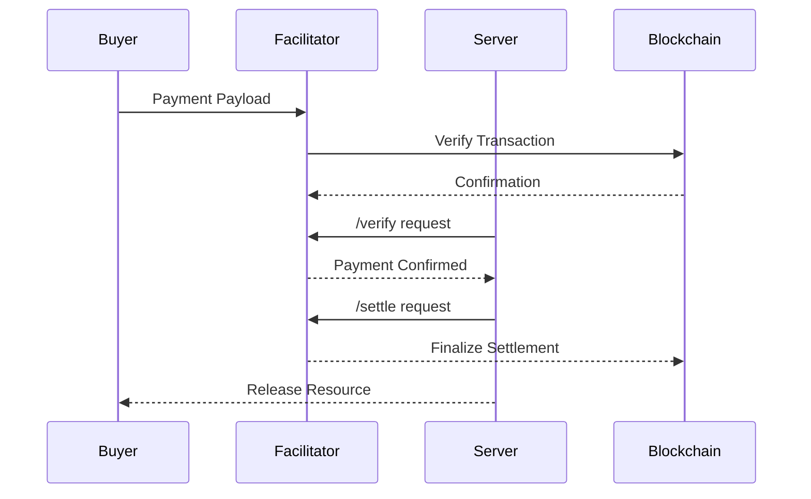

## What is a Facilitator?

A **facilitator** is the operational backbone of the x402 protocol. It acts as the settlement layer that coordinates payment verification between buyers and sellers without taking custody of funds or requiring identity verification.

Think of it as a neutral third party that:
- Receives payment payloads from buyers
- Verifies transactions on-chain
- Signals to servers when payment is confirmed
- Enables servers to release resources only after successful payment

## The x402 Protocol

The x402 protocol enables **HTTP-based payments** for any endpoint. It's designed for:

- **Autonomous agents** that need to transact without human intervention
- **Micropayments** where traditional payment rails are too expensive
- **Usage-based pricing** without upfront commitments
- **Permissionless access** to services and data

## How Payment Flow Works

### Step-by-Step

1. **Buyer Initiates Payment**
   - Buyer sends payment payload to the facilitator
   - Includes transaction details and target endpoint

2. **Facilitator Verification**
   - Facilitator receives the payload
   - Verifies transaction on the blockchain
   - Maintains payment authorization

3. **Server Verification**
   - Server calls `/verify` endpoint
   - Facilitator confirms payment is valid
   - Server knows it's safe to proceed

4. **Settlement**
   - Server calls `/settle` to finalize
   - Facilitator coordinates on-chain settlement
   - Server releases the requested resource

## Why Multi-Chain Matters

OpenX402 supports **Base, X Layer, and Solana** because:

- **Different Use Cases**: Some applications need Base's security, others need Solana's speed
- **Liquidity Options**: Users can pay with assets on their preferred chain
- **Network Effects**: More chains = more users = more adoption
- **Resilience**: Multi-chain support prevents single points of failure

## Key Principles

<CardGroup cols={2}>
  <Card title="No Custody" icon="hand-holding-dollar">
    OpenX402 never holds your funds. Payments flow directly on-chain.
  </Card>
  <Card title="No Identity" icon="user-secret">
    No API keys, no KYC, no accounts. Just wallets and transactions.
  </Card>
  <Card title="Instant Verification" icon="gauge-high">
    Real-time on-chain verification enables instant service delivery.
  </Card>
  <Card title="Open Access" icon="door-open">
    Anyone can use OpenX402. No permission required.
  </Card>
</CardGroup>

## Comparison to Traditional APIs

| Feature | Traditional APIs | OpenX402 |
|---------|------------------|----------|
| Authentication | API Keys | Wallet Signatures |
| Payment | Monthly/Annual | Pay-per-use |
| Setup | Registration + KYC | Connect Wallet |
| Access Control | Identity-based | Payment-based |
| Custody | Prepaid Balance | Non-custodial |

## Next Steps

<CardGroup cols={2}>
  <Card title="Get Started" icon="play" href="/quickstart">
    Build your first OpenX402 integration
  </Card>
  <Card title="Explore Use Cases" icon="lightbulb" href="/use-cases">
    See what you can build
  </Card>
</CardGroup>
