## Get Running in 5 Minutes

The fastest way to understand OpenX402 is to run our production IPFS gateway starter. You'll have a working paywall-protected API running locally in minutes.

<Card
  title="Live Demo"
  icon="rocket"
  href="https://ipfs.openx402.ai"
>
  See the starter running in production at ipfs.openx402.ai
</Card>

## What You'll Build

A **paywall-protected IPFS gateway** that:
- Serves IPFS content behind a payment wall
- Accepts USDC payments on Base network
- Verifies payments through OpenX402
- Returns 402 Payment Required for unpaid requests

## Prerequisites

- Node.js 18+ installed
- Git
- 5 minutes of your time

**No wallet or crypto needed for local testing!**

## Step 1: Clone the Starter

Clone the x402-ipfs-starter-server repository:

```bash
git clone https://github.com/openx402/x402-ipfs-starter-server
cd x402-ipfs-starter-server
```

<Card
  title="View on GitHub"
  icon="github"
  href="https://github.com/openx402/x402-ipfs-starter-server"
>
  Browse the full source code
</Card>

## Step 2: Install Dependencies

```bash
npm install
```

This installs:
- Express.js (web server)
- ethers (blockchain interaction)
- Other dependencies for IPFS and payment handling

## Step 3: Run the Server

```bash
npm start
```

Your server is now running on `http://localhost:3000`!

```
🚀 OpenX402 IPFS Gateway running on port 3000
📦 Serving IPFS content with x402 payments
💰 Facilitator: https://openx402.ai/base
```

## Step 4: Test It Out

### Test Without Payment

Try accessing IPFS content without payment:

```bash
curl http://localhost:3000/ipfs/QmXxxx...
```

**Response: 402 Payment Required**

```json
{
  "error": "Payment required",
  "facilitator": "https://openx402.ai/base",
  "amount": "0.01",
  "network": "base",
  "message": "Please submit payment to access this content"
}
```

This is the **402 Payment Required** HTTP status code in action! Your server is protecting the IPFS content behind a paywall.

### Understanding the Response

The 402 response tells clients:
- **facilitator**: Where to send payment (OpenX402 on Base)
- **amount**: How much USDC is required (0.01 USDC)
- **network**: Which blockchain to use (Base)

## Step 5: See How It Works

Let's look at the key code that makes this work:

### The Payment Check

```javascript
app.get('/ipfs/:cid', async (req, res) => {
  const paymentProof = req.headers['x-402-payment'];

  // No payment provided?
  if (!paymentProof) {
    return res.status(402).json({
      error: 'Payment required',
      facilitator: 'https://openx402.ai/base',
      amount: '0.01',
      network: 'base'
    });
  }

  // Verify payment with OpenX402...
});
```

### Payment Verification

```javascript
// Verify payment with OpenX402
const verification = await fetch('https://open.x402.host/verify', {
  method: 'POST',
  headers: { 'Content-Type': 'application/json' },
  body: JSON.stringify({
    proof: paymentProof,
    network: 'base'
  })
});

const result = await verification.json();

if (!result.valid) {
  return res.status(402).json({ error: 'Invalid payment' });
}

// Payment verified! Serve the content
const ipfsContent = await fetchFromIPFS(req.params.cid);
res.send(ipfsContent);
```

That's it! Three simple steps:
1. Check if payment was provided
2. Verify payment with OpenX402
3. Deliver content if valid

## How the Payment Flow Works

```mermaid
sequenceDiagram
    User->>Gateway: GET /ipfs/Qmxxx
    Gateway->>User: 402 Payment Required
    User->>Base Network: Submit USDC payment
    Base Network->>User: Transaction confirmed
    User->>Gateway: GET /ipfs/Qmxxx + payment proof
    Gateway->>OpenX402: Verify payment
    OpenX402->>Gateway: ✓ Valid
    Gateway->>IPFS: Fetch content
    IPFS->>Gateway: Content
    Gateway->>User: 200 OK + IPFS content
```



## Project Structure

```
x402-ipfs-starter-server/
├── src/
│   ├── server.js         # Main Express server
│   ├── payment.js        # OpenX402 integration
│   └── ipfs.js           # IPFS fetching logic
├── package.json
└── README.md
```

### Key Files

**server.js** - Main application
- Sets up Express routes
- Handles payment checks
- Returns 402 for unpaid requests

**payment.js** - Payment verification
- Calls OpenX402 /verify endpoint
- Validates payment proofs
- Handles Base network transactions

**ipfs.js** - IPFS integration
- Fetches content from IPFS
- Caches responses
- Handles errors

## Customize It

### Change the Price

Edit the payment amount in `src/server.js`:

```javascript
amount: '0.01' // Change to your desired USDC price
```

### Use a Different Network

Switch from Base to Solana or another chain:

```javascript
{
  facilitator: 'https://openx402.ai/solana',
  network: 'solana',
  amount: '0.01'
}
```

### Add Your Own Logic

Add custom business logic after payment verification:

```javascript
if (result.valid) {
  // Your custom logic here
  await logPayment(result.transactionId);
  await checkRateLimit(req.ip);
  await updateAnalytics(req.params.cid);

  // Then serve content
  return serveContent();
}
```

## Deploy to Production

The starter is production-ready and can be deployed anywhere:

### Deploy to Fly.io

```bash
fly launch
fly deploy
```

### Deploy with Docker

```bash
docker build -t x402-ipfs-gateway .
docker run -p 3000:3000 x402-ipfs-gateway
```

### Environment Variables

```bash
PORT=3000
FACILITATOR_URL=https://openx402.ai/base
IPFS_GATEWAY=https://ipfs.io
```

## Real Production Example

This exact code is running at **ipfs.openx402.ai**, serving IPFS content to real users with real payments.

Try it:

```bash
# Returns 402 Payment Required
curl https://ipfs.openx402.ai/ipfs/QmXxxx...
```

## What's Next?

Now that you have the starter running, explore these resources:

<CardGroup cols={2}>
  <Card title="Core Concepts" icon="book" href="/concepts">
    Learn how facilitators work
  </Card>
  <Card title="Use Cases" icon="lightbulb" href="/use-cases">
    See what else you can build
  </Card>
  <Card title="API Reference" icon="code" href="/api-reference/introduction">
    Complete API documentation
  </Card>
  <Card title="Networks" icon="link" href="/networks/base">
    Explore Base, Solana, and more
  </Card>
</CardGroup>

## Testing with Real Payments

Ready to test with actual USDC payments?

1. **Get a wallet** - Install MetaMask or Coinbase Wallet
2. **Get USDC on Base** - Bridge USDC to Base network
3. **Make a payment** - Use the /test endpoint first ($0.0001 USDC)
4. **Include payment proof** - Add `X-402-Payment` header with proof

See [/test endpoint docs](/api-reference/test) for details on testing with minimal cost.

## Common Questions

<AccordionGroup>
  <Accordion title="Do I need a wallet to run the starter?">
    No! The starter runs locally without any wallet. You only need a wallet when testing real payments.
  </Accordion>

  <Accordion title="How much does it cost to test?">
    Use the `/test` endpoint which costs only $0.0001 USDC. Perfect for testing without spending real money.
  </Accordion>

  <Accordion title="Can I use this for non-IPFS content?">
    Absolutely! The payment logic works for any API, database, or service. Replace the IPFS fetching with your own logic.
  </Accordion>

  <Accordion title="Which networks are supported?">
    OpenX402 supports Base, Solana, X Layer, Polygon, and BSC. See [Supported Chains](/chains) for details.
  </Accordion>
</AccordionGroup>

## Need Help?

- **GitHub Issues**: [Report bugs or ask questions](https://github.com/openx402/x402-ipfs-starter-server/issues)
- **Community**: Follow [@openx402 on X](https://x.com/openx402)
- **Live Demo**: Test at [ipfs.openx402.ai](https://ipfs.openx402.ai)

## More Examples

Looking for other use cases? Check out our [Starter Projects](/starter-projects) page for more examples and templates.
